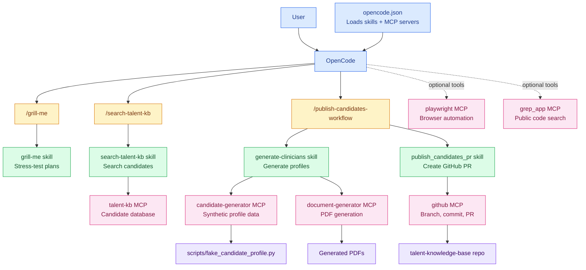

# Automation Hub

A collection of AI-powered tools and workflows that you can use to automate tasks in OpenCode.

## What is this?

This is a library of reusable **skills** and **commands** that extend OpenCode's capabilities. Think of it as a toolkit where you can:
- Create and manage automation workflows
- Run common tasks with simple commands
- Build enterprise automation solutions

## Quick Start

### Available Commands

Use these slash commands in OpenCode:

- `/grill-me` - Stress-test a plan or design
- `/search-talent-kb` - Search candidates in the talent knowledge base
- `/publish-candidates-workflow` - Generate candidate PDFs and publish them via GitHub PR

### How to Use

1. Start OpenCode
2. Type a slash command (e.g., `/publish-candidates-workflow`)
3. Follow the prompts to complete the workflow

## Architecture

## Skills (Automation Workflows)

This repo includes several skills that power the commands:

- **grill-me** - Tests your plans with rigorous questioning before you build
- **generate-clinicians** - Creates synthetic healthcare candidate profiles
- **publish_candidates_pr** - Commits candidates to Git and creates pull requests

## Setup

After you add or update skills and commands, **restart OpenCode** so it loads your changes.

## Need Help?

- Check `.opencode/skills/` to see how skills are built
- Look at `.opencode/commands/` to see how commands are structured
- See `AGENTS.md` for detailed development guidelines

---

Built with OpenCode. Learn more at [opencode.ai](https://opencode.ai)
